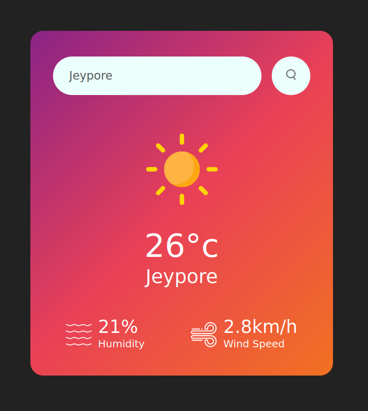

# Weather App

A sleek and user-friendly weather app that provides real-time weather information for any location worldwide. Built with HTML, CSS, and JavaScript, the app fetches data using a weather API and displays it in a clean interface.

## Features

- Search for weather information by city name.
- Displays temperature, humidity, wind speed, and weather conditions.
- Dynamically updates based on user input.
- Mobile-friendly and responsive design.

## Live Demo

Check out the live app here: [Weather App Live](https://swag3009.github.io/Weather_App/)

## Screenshots



## Technologies Used

- **HTML**: Structuring the layout of the app.
- **CSS**: Styling the app for an appealing user interface.
- **JavaScript**: Fetching weather data and dynamically updating the app.

## How to Use

1. Open the app using the [live demo link](https://swag3009.github.io/Weather_App/).
2. Enter the name of the city in the search bar and hit Enter.
3. View the weather details displayed on the screen.

## How It Works

- The app fetches weather data using a weather API (e.g., OpenWeatherMap API).
- When a user enters a city name, the app sends a request to the API and retrieves the data in JSON format.
- JavaScript processes and displays the data on the page.

## Installation and Setup

1. Clone the repository:
   ```bash
   git clone https://github.com/Swag3009/Weather_App
   ```
2. Navigate to the project directory:
   ```bash
   cd Weather-App
   ```
3. Open the `index.html` file in your browser to view the app.

